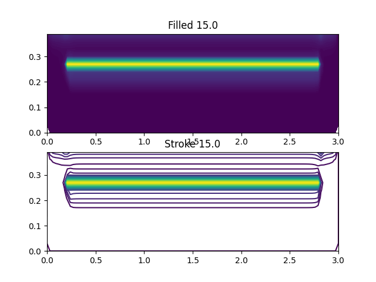

# Heat transfer

This is my university project for heat transfer class. It works by specifying the structure of your item as a matrix and passing it to the solver.
The solver then calculates the correct time-based temperatures based on the heat transfer coefficient.

## Installation and usage

### Installation

You need at least python version `>3.11` for this application to work. To install the requirements using `pip`, run the following command:

```sh
pip install -r requirements.txt
```

### Usage

1. Change the matrix in the `main.py` based on the structure of your element
1. Run the code using python
1. If enabled, the output data will be generated in `data` directory, and plots will be generated in the `plots` directory

## Sample results

This plots are calculated for room with in-ground heating:




More plots can be found in the `plots` directory.
